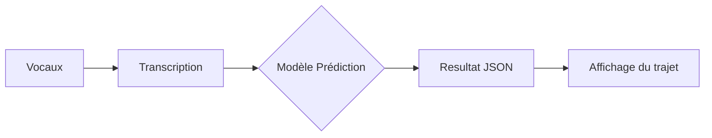

# T-AIA-901

## Information de projet

📁 [Repository](https://github.com/MetalBrackets/T-AIA-901)  
📁 [Mirror](https://github.com/EpitechMscProPromo2025/T-AIA-901-NAN_3)

### Contribuer

-> Guide de [contribution](CONTRIBUTING.md)

## Fonctionnalités

- Un module speech to text
- Un module NLP
- Un module pathfinder
- Une UI sympa à utiliser

### Diagram de flux



### Specifications

**1. Le module speech to text**

- Enregistre et lit un signal vocal
- Retourne la phrase en JSON ou _stdout_

```
# Algo - Transcription
return : sentenceID, sentence
```

**2. Le module NLP**

- Il reçois en entrée la phrase
- Il identifie le départ et la destination
- Il calcule le temps de trajet (durée de A à C en passant par B = durée de A à B + durée de B à C)
- Pour une commande non valide il retourne un message d'information  
  `sentence ID, Code=['NOT_FRENCH', 'UNKNOWN', 'NOT_TRIP]`
- Pour une commande valide il retourne  
   `sentenceID, Departure, Destination`

```
Algo - NLP
- Relations entre les mots qui peuvent être au début ou à la fin d'une séquence
- compréhention d'un départ et d'une arrivée (met les waypoint en negatif)
- compréhension des noms composés, ex : Port-Boulet
- différencier une ville d'un prénom, ex: Albert
```

**3. Le pathfinder**

- Il reçoit `sentenceID, Departure, Destination`
- Il trouve le meilleur trajet - tous les arrêts - parmi toutes les gares entre 2 coordonnées GPS

```
Algo - Chemin optimal dans un graph
- Trouver un chemin dans un graph
- Rétropropagation
```

\_ Notes :

- 🧪 Les models doivent être testés avec des metrics (accuray, lost, confusion matrix...)
- UTF8
- Finetune CamemBERT
- 2 fichiers sont fournies dans Gandalf

**3. Dataset**

- Mettre en place un Datasest de train et de test

## Prerequis

- Python ≥ 3.11
- Poetry -> [install](https://python-poetry.org/docs/#installation)

## Setup

```bash
poetry install
poetry shell
cd aia-script/2_module_NLP/
poetry run script-NLP.py
```

## Packages

```bash
pip install streamlit
pip install streamlit_folium
pip install folium
pip install geopy
pip install shapely
# https://www.nltk.org/
pip install nltk==3.6.5
```

## Lint

Lancer le script suivant pour lancer pylint  
(🕶 pylint est basé sur les normes PEP 8 et bien +)

```bash
./lint.sh
```

## Configuration des secrets

Dupliquez le fichier `env.example` et renommez la copie en `.env`. Ce fichier contient les secrets (clé d'API). Il ne doit jamais être push sur le repo.
